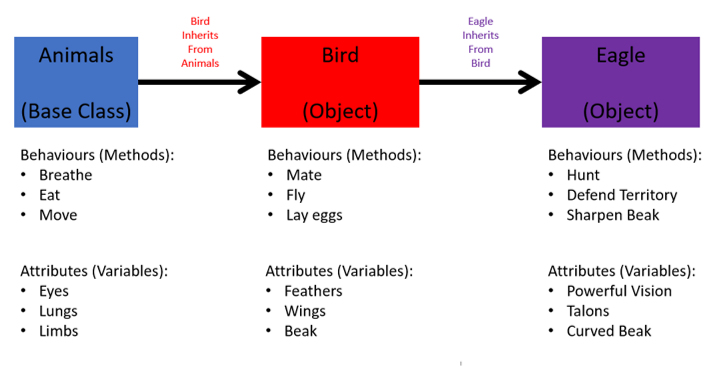

# OOP Four Pillars

### What is OOP?
**Object-Oriented Programming** is a programming model based on the concept of "objects", which can contain data and code.
The object can be based on a blueprint or parent which defines properties and methods it inherits and has access to and can use.
A  blueprint or parent that objects inherit from would be "classes".


### The Four Pillars of OOP
OOP has 4 main theoretical principles which are:
- Abstraction
- Inheritance
- Encapsulation
- Polymorphism
### Abstraction
Abstraction is the concept of simplifying things, taking away or removing characteristics from something, reducing it to a set of essential characteristics.
Take this example below
```python
class Animal:   # In the class we can see all the attributes and methods we've set
    def __init__(self):   
        self.alive = True
        self.spine = True    # These are attributes vital to our Animal class
        self.eyes = True
        self.lungs = True
    def breathe(self):
        print("One breath in, one breath out")

    def eat(self):           # Theese are behaviours of all animals and thus all of our objects will have these methods 
        print("Nom Nom Nom")

    def move(self):
        print("Onwards and Upwards")
```
### Inheritance
Inheritance is the mechanism for creating a child class (subclass) that can inherit behaviour and properties from a parent class (superclass). This allows our code to be reusable, sparing us from having to repeat the same line of code for our subclasses.
```python
from animal import Animal # Animal is our base class that we created in another file called animal.py

class Reptile(Animal):    # We include our base class 'Animal' which is the superclass to Reptile

    def __init__(self):
        super().__init__()   # This is important, initialise with the superclass attributes first
        self.cold_blooded = True
        self.tetrapod = None 
        self.heart_chambers = [3,4]
        self.amniotic_eggs = None

    def seek_heat(self):
        print("Its chilly outside, where is the sun?")

    def use_venom(self):
        print("If I've got it, I'm going to use it")

    def attract_through_scent(self):
        print("Come take a whiff darling ;)")

jeremy_the_reptile = Reptile()
jeremy_the_reptile.breathe()    # Animal class method
jeremy_the_reptile.seek_heat()       # Reptile class method
```
### Encapsulation
Encapsulation is the method of keeping all the state, variables, and methods private unless declared to the user.
Encapsulation is about having a simple interface for the user to interact with, and keeping away the inner workings of our object a mystery.
```python
from reptile import Reptile

class Snake(Reptile):

    def __init__(self):   # The user does not need to see these
        super().__init__()
        self.forked_tongue = True
        self.venom = None
        self.limbs = False

    def use_tongue_to_smell(self):
        print("Do I say it smells or tastes nice?")

sidney = Snake()
sidney.hunt()     # Reptile class method, the user does not need to see how it works
```
### Polymorphism
Polymorphism literally means "many forms".
Polymorphism is a way of interfacing with objects and receiving different results. For example suppose we have a car, washing machine and a dvd player.
All of these would have a "start" method but of course despite having the same method we will have different results i.e. the car starts its engine, the washing machine begins washing clothes and the dvd player starts showing the content of the disc inside.
```python
from snake import Snake

class Python(Snake):

    def __init__(self):
        super().__init__()
        self.large = True     # General note with class variables, they MUST be set
        self.venom = False
        self.two_lungs = True

    def digest_large_prey(self):
        print("Ok let me get my stretchy pants")

    def constrict(self):
        print("Squeeeeeeeze")

    def climb(self):
        print("Look at me going up the ladder!")

peter = Python()
peter.eat() # from Animal
peter.hunt() # from Reptile
peter.use_tongue_to_smell() # from Snake
peter.constrict() # from self
```
### What are the Benefits of OOP?
The benefits of OOP include:
- Modularity
- Reusability
- Flexibility
- Security 
- Easily upgradable and scalable
- Simplicity